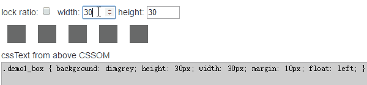

# CSSOBJ

[](https://travis-ci.org/cssobj/cssobj) [Github Repo](https://github.com/cssobj/cssobj)

CSS in JS solution, [CSSOM](https://developer.mozilla.org/en-US/docs/Web/API/CSS_Object_Model) from js, getting and setting CSS stylesheet rules, css modules inside JS components, media query for old browsers. Good for MVC frameworks.

Light weight: **only 1 file, 3K gzipped, no dependencies**

Well [tested](https://github.com/cssobj/cssobj#test), easy to use in your project, see [Wiki](https://github.com/cssobj/cssobj/wiki/Work-with-popular-JS-Lib)

[Live demo](https://cssobj.github.io/cssobj-demo/)

[](https://cssobj.github.io/cssobj-demo/#demo1)

## Why?

For a long time, the way for javascript to dynamicly change css is via **DOM.style**, like below:

``` javascript
document.getElementById('domID').style.color = 'red'
document.getElementById('domID').style.fontSize = '14px'
```

or jQuery (or similar lib):

``` javascript
$('div').css({color:'red', fontSize:'14px'})
```

But the first way is poor, the second way need jQuery lib, interactive with DOM, and have performance issues.

**But ALL of them is not updating css rules**.

[CSSOM](https://developer.mozilla.org/en-US/docs/Web/API/CSS_Object_Model) is the base stone of browser, and it have good javascript API, why not using it?

**cssobj** is the modern CSSOM **generate** and **diff** engine, see below:

```javascript
/* script in your <head> */
var obj = {div: {color:'red', fontSize:'12px'}}
var ret = cssobj(obj)
```

Then all `div` will have `color: red;`, currently and future!

Want to dynamicly update?

```javascript
/* script in your <head> */
obj.div.color = 'blue'
ret.update()
```

Then all `div` will update css `color: blue;`. No jQuery, no wait for **DOM**, no `window.onload`!

The cool thing is:

 - **You never need to wait for DOM any more**

 - **cssobj will only update changed value, good for performance!**


## Install:

- Download this repo, and check the dist folder.

- This project currently not published to `npmjs`, please using below to install from github directly:

``` javascript
npm install cssobj/cssobj
```

## Usage:

**cssobj** is universal lib for manipulate **CSSOM**, below is just some use case:

### Case 1: you want local class names

Think below normal stylesheet:

``` html
<style>
  body { color: red; }
  .item  { font-size: 12px; }
  .item span { color: blue; }
</style>
```

You will have the **pain** by sharing to others with class name conflict, so

#### Using *cssobj* instead:

Include **dist/cssobj.min.js** into `<head>`, add code below:

``` html
<script src="dist/cssobj.min.js"></script>
<script>
var obj = {
  body: {
    color:'red'
  },
  '.item': {
    fontSize: '12px',
    span: { color: 'blue' }
  }
}
var result = cssobj(obj, {local:true})
</script>
```

This will generate [CSSOM](https://developer.mozilla.org/en-US/docs/Web/API/CSS_Object_Model) in your `<head>`, with below css:

``` css
body {
  color: red;
}
._1jkhrb92_item {
  font-size: 12px;
}
._1jkhrb92_item span {
  color: blue;
}
```

Class names will add a random prefix, you can get the altered class name using below:

``` javascript
result.mapSel('.item')   // === ._1jkhrb92_item (with dot)
result.mapClass('.item')   // === _1jkhrb92_item (without dot)
```

You can also specify your own `prefix`.

``` javascript
var result = cssobj(obj, {local: {prefix:'_yourown_'} })
// .item -> ._yourown_item
```

### Case 2: you want dynamicly update you css rule

Change stylesheet using js?

``` javascript
document.getElementById('id').style.fontSize = '12px'
```

No, it's not updating css rule. Change **DOM** is the **old way**.

#### Using *cssobj* to update CSSOM:

``` javascript
var obj = {
  div: {fontSize:'12px'}
}
var css = cssobj(obj)
```

If you want to update the rule later:

``` javascript
... ...
obj.div = {color:'red', fontSize:'14px'}
css.update()
```

Then all your `div` (current and future added!) will have the new rule.

The performance is optimized, only updating changed prop, keep others **untouched**!


### Case 3: you want @media rule work in old Browsers

Just try this [demo](https://cssobj.github.io/cssobj-demo/play/), in IE 8, or IE 7, or IE 5!

## How it worked?

1. **cssobj** first parse js object into **Virtual CSS** middle format.

2. The internal [plugin-cssom](https://github.com/cssobj/cssobj-plugin-post-cssom) will create stylesheet dom, and apply rules from middle format.

3. When the js object changed, **cssobj** will diff CSSOM rules (**add/delete/change**) accordingly. (see [demo](https://cssobj.github.io/cssobj-demo/#demo1))

## Benefit

What's the benefit? See below:

### 1. Live update

```js
obj.div.fontSize = '16px'
result.update()
```

Then the actual style sheet will update the `div` selector rule, set `font-size` to `16px`.

### 2. Dynamic caculation

```js
obj.div.width = function(){ return window.innerWidth / 3 + 'px' }
obj.div.height = function(){ return this.width }
result.update()
```

Then all the `div` will have same width & height, as 1/3 of window width, magicly!

### 3. Hot replacement

```js
obj.div.span = {color:'green', marginLeft: '20px'}
result.update()
```

Then the old `span` selector will be replaced by the new rule.

### 4. @media support in old browsers

```js
cssobj({
  div:{ color:'red' },
  '@media (max-width: 768px)':{
    div:{ color:'green' },
    '@media (min-width: 480px)':{
      div:{ color:'blue' }
    }
  }
})
```

Then `div` will have color as **red**, **green** and **blue** accordingly, in **ALL BROWSERS** (IE5+, except IE6, contribution welcome!)

[Demo](https://cssobj.github.io/cssobj-demo/play/) here for **@media (min-width), (max-width)** support for old browsers.

Below is the screencast with **@media** rule response support in **IE 5** (oh my!)

[](https://cssobj.github.io/cssobj-demo/play/)

### 5. Localized class names

```js
var ret = cssobj({
  body:{ color:'red' },
  '.item':{ color:'blue' }
}, {local : true} )
```

will get CSSOM as below:

```css
body { color: red; }
._1c0b3bn4_nav { color: red; }
```

There's no class name conflict. You can customize the `prefix` as you need, or turn off this feature.

### 6. Small and smart

Only one js file with no dependencies, **3K** gzipped.

Easy to plugin, and there're plenty of them.

Virtual CSS middle format is JS object, thus can avoid the differences of CSS engines, dynamicly caculated.

## API

### `var result = cssobj(obj, options)`

parse obj, generate virtual css, then render `<style>` tag into `<head>`

#### *PARAMS*

#### `obj`

Type: **{object|array}**

Nothing special, just plain js `Object`, or `Array` of `Object`, with below rules:

* non-object(`string|number`) value act as css value.

* if value is object, key will act as css selector.

* if value is non-object, key will act as css property.

#### `options`

Type: **{object}**

name | type | default | description
-----|-----|-----------|---------------
local | Boolean or Object | false | `true` to localize class names, using `options.local.prefix` as prefix.
local.prefix | String | random string | prefix for localized names, will using `random()` function in [cssobj-helper](https://github.com/cssobj/cssobj-helper) if not specified or as falsy.
local.localNames | Object | { } | predefined `key - val` to control each class name when localized.
plugins | Object | { } | supported key is `post`, `value`, `selector`, each must be function or array of functions.

#### *RETURN*

cssobj `RESULT` object


### `RESULT` OBJECT

The return value of `cssobj()` and `result.update()`, it's a js object with below keys:

name | type | description
-----|-----|-----------
obj | Object | The source js object for `cssobj()` function call.
root | Object | Virtual CSS object parsed from `obj`, mainly used for value functions and plugins.
nodes | Array | Array of virtual css nodes, for the convinence of `filter` or `map` etc.
mapSel | Function | Get localized class name from selector string. Function signature is `function({string} selector){ return {string} mappedSel }`.
mapClass | Function | Get localized class name from class list string. Function signature is `function({string} classList){ return {string} mappedClassList }`.
ref | Object | Key/value pairs for named objects. Named objects is objects with `$id` string value in `obj`.
update | Function | Update the `RESULT` object from `obj`, generate `diff`, update CSSOM and all relevent data. Function signature is `function updater ([{object} data]) { return {object} result }`
-  | *updater param*:<br>data | [optional] Passed to `update()` function, and set to `RESULT` `data` value, for later use.
diff | Object | Set from `update()` function, with `added`, `removed`, `changed` nodes and props.
data | Object | Store for data parameter of `update()` function, can be referenced and changed in object functions and plugins.
options | Object | Store for `cssobj()` `options` parameter, can be referenced and changed in object functions and plugins.
cssdom | Stylesheet<br>Element | Style sheet element generated by `cssobj()` function. Each call of `cssobj()` will generate a new cssdom. `update()` function only update cssdom with `diff` result.

## Plugins

- [cssobj-plugin-selector-localize](https://github.com/cssobj/cssobj-plugin-selector-localize) Localize class names in selector

- [cssobj-plugin-value-default-unit](https://github.com/cssobj/cssobj-plugin-value-default-unit) Add default unit to numeric values, e.g. width / height

- [cssobj-plugin-post-gencss](https://github.com/cssobj/cssobj-plugin-post-gencss) Generate css text from virtual css

- [cssobj-plugin-post-cssdom](https://github.com/cssobj/cssobj-plugin-post-cssom) Add style dom to head and update rules from virtual css diff result

- [cssobj-plugin-post-stylize](https://github.com/cssobj/cssobj-plugin-post-stylize) Add style dom to head then update css from gencss plugin, small in size

- [cssobj-plugin-post-csstext](https://github.com/cssobj/cssobj-plugin-post-csstext) Display cssText from CSSOM

*More plugins welcome!*

## Demos

[cssobj-demo](https://github.com/cssobj/cssobj-demo)

## Tools

[cssobj-converter](https://github.com/cssobj/cssobj-converter)

## Helpers

[cssobj-mithril](https://github.com/cssobj/cssobj-mithril) Help cssobj to work with [mithril](https://github.com/lhorie/mithril.js)

*More helper welcome!*

## Test

Using [phantom](http://phantomjs.org/) 2.0 to test with CSSOM. Please see **test/** folder.

## Remark

cssobj is wrapper for [cssobj-core](https://github.com/cssobj/cssobj-core), [plugin-localize](https://github.com/cssobj/cssobj-plugin-selector-localize) and [plugin-cssom](https://github.com/cssobj/cssobj-plugin-post-cssom).

## Contribute

Yes! We need you! Think below way:

 - Please use cssobj in your project.

 - Please tell your friend about cssobj.

 - Please post issues for your idea and for bug.

 - Please read source, improve it!

## License

MIT © James Yang
